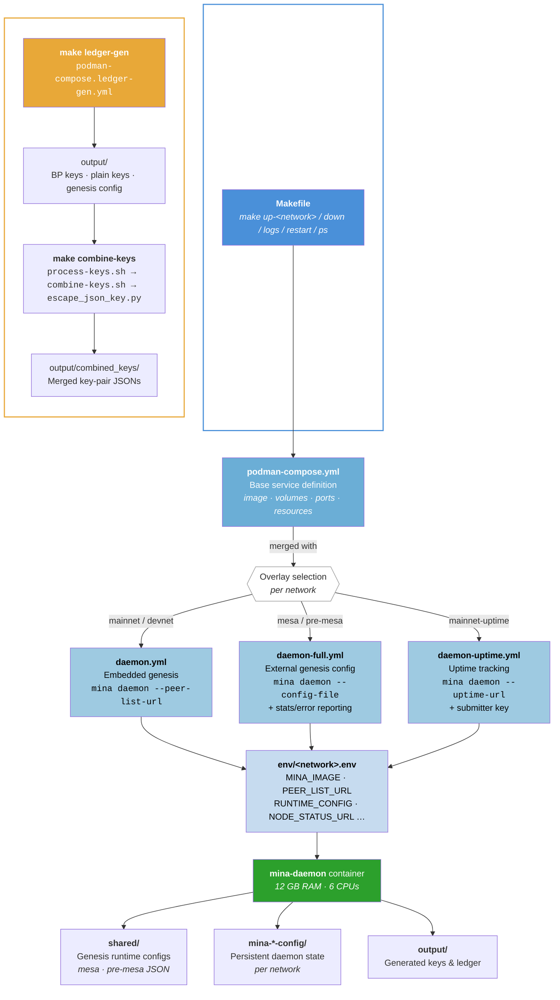

# mina-node-deployments

A collection of different ways to deploy Mina Protocol nodes.

## Architecture Overview



### Configuration Layering

Each `make up-<network>` composes three layers into a single deployment:

```
podman-compose.yml            ← base service (image, volumes, ports, resources)
  + podman-compose.<mode>.yml ← overlay (entrypoint & daemon flags per mode)
  + env/<network>.env         ← variables (image tag, peers, endpoints)
```

| Network | Overlay | Genesis | Reporting |
|---------|---------|---------|-----------|
| `mainnet` | `daemon` | Embedded in image | — |
| `devnet` | `daemon` | Embedded in image | — |
| `mesa` | `daemon-full` | External JSON in `shared/` | Stats + errors |
| `pre-mesa` | `daemon-full` | External JSON in `shared/` | Stats + errors |
| `mainnet-uptime` | `daemon-uptime` | Embedded in image | Uptime metrics |

## Deployment Methods

| Method | Description | Link |
|--------|-------------|------|
| **podman-daemon** | Podman/Docker Compose configs for running Mina daemon nodes with configurable network and mode selection | [podman-daemon/](podman-daemon/) |

## License

MIT — see [LICENSE](LICENSE).
